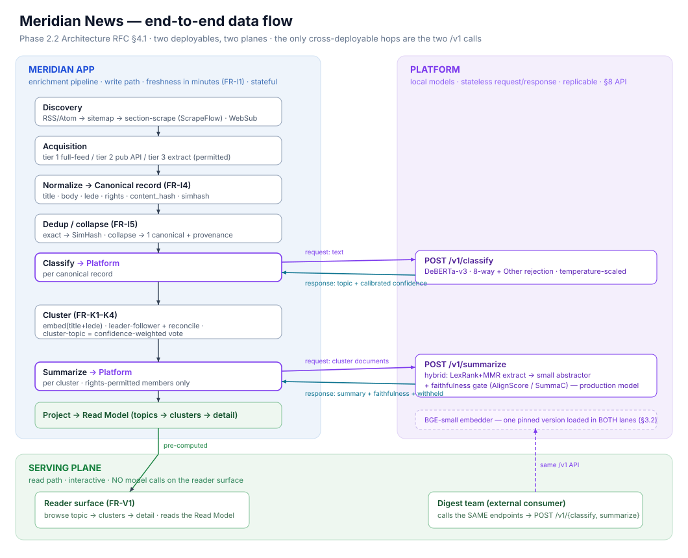

# Meridian News

A news aggregator. It ingests articles from many publishers, sorts them into topics, groups the ones covering the same event, and writes a short summary of each group — so a reader browses stories rather than a list of near-duplicate headlines.

It is built on a **Summarization & Classification Platform**: a separate, general-purpose service that does the model work and is consumed by Meridian and by other internal products.

**All inference runs locally.** Self-hosted models only — HuggingFace transformers, ONNX Runtime and Triton. No external inference APIs.

## How it works

The write path is a pipeline. Each article moves through it one stage at a time, and its position is a column in the database.

| Stage | What happens |
|---|---|
| **Discovery** | Poll each feed for new URLs — RSS/Atom first, then sitemaps, then section scraping. Re-polling is idempotent: a feed shows the same article for hours, and the schema is what stops it being stored twice |
| **Acquisition** | Fetch the article, by whichever tier the source's rights allow: full feed content, publisher API, or extraction |
| **Normalization** | Reduce the page to a canonical record — title, body, lede, publisher, timestamp, content hash. Rights are read from the source registry rather than copied onto the record, so a change applies to articles already ingested |
| **Deduplication** | Detect syndicated reprints by exact hash, then by SimHash near-match. Duplicates are collapsed into one record that keeps every source as provenance, rather than dropped |
| **Classification** | Ask the Platform for a topic and a calibrated confidence. Low-confidence articles fall to `Other` instead of being forced into a topic |
| **Clustering** | Embed title and lede, assign to a cluster of the same event by online leader-follower matching, then reconcile in batch. A cluster's topic is a confidence-weighted vote of its members |
| **Summarization** | Ask the Platform to summarize the cluster from its rights-permitted members. A faithfulness check runs on the result, and a summary that fails it is withheld rather than shown |
| **Projection** | Write the result into a read model shaped for browsing: topics → clusters → article detail |

Discovery's cadence, and every other value that must change without a redeploy, lives in a runtime config table the pipeline reads each cycle — not in a constant and not in an environment variable. Publishers, their feeds and their rights live in a source registry alongside it, and both are edited through the admin surface.

The read path only reads that projection. **The reader surface calls no model** — every page it serves was computed upstream on the write path.

A summary is withheld for three distinct reasons, and they are stored and rendered separately: the faithfulness check failed, the sources' rights do not permit it, or the cluster still has only one source.

## Architecture

Two deployables:

- **Platform** — stateless, holds the models, exposes `POST /v1/classify` and `POST /v1/summarize`.
- **Meridian app** — a modular monolith that owns the pipeline, the database and the reader surface, and calls the Platform for the two model steps. It also serves the source registry's admin surface at `/admin/sources`, behind a shared credential.

The only cross-deployable hops are those two calls. The Digest team consumes the same endpoints.

The wire contract is `platform/openapi.json`, generated from the Pydantic models in
`libs/contract` by `python -m meridian_platform.openapi` and checked by a test, so it cannot
drift from the service. It is published to consuming teams: a diff to it is a change to an
interface other teams have built against, and is reviewed as one.



## Design decisions

| Area | Decision |
|---|---|
| Language | Python 3.12, both deployables |
| Web | FastAPI + Uvicorn; the published contract is generated from Pydantic |
| Storage | PostgreSQL 16; SQLAlchemy 2.x + Alembic |
| Work queue | `pipeline_state` on the canonical record, claimed with `SELECT … FOR UPDATE SKIP LOCKED`. No broker |
| Scheduling | APScheduler in-process; poll cadence is configuration, not a constant |
| Classification | Fine-tuned DeBERTa-v3-base on CPU, with temperature scaling |
| Clustering | SimHash near-duplicate detection → BGE-small embeddings → leader-follower + batch reconciliation. No vector database, no ANN index |
| Summarization | Chosen by a bake-off against the project's own evaluation set |
| Faithfulness | AlignScore or SummaC; a failed check withholds the summary |
| Serving | Triton-class multi-backend, CPU-first. Production requires no GPU |
| Tooling | uv workspaces · ruff + mypy · pytest |

## Layout

```text
meridian/              # the product app
  ingest/              # discovery, acquisition, normalization
  db/                  # schema, repositories, the work queue
  web/                 # the admin surface over the registry and runtime config
  dedup/               # SimHash near-duplicate detection and collapsing
  cluster/             # leader-follower matching + reconciliation
  readmodel/           # projection + reader surface
  platform_client/     # generated from libs/contract
platform/              # the stateless Platform service
  api/                 # FastAPI app; the versioned contract surface
  models/              # classify / summarize / faithfulness
libs/
  contract/            # shared Pydantic schema — source of the published contract
  config/              # process bootstrap: database URLs, credentials, API limits
eval/                  # model evaluation harness
migrations/            # Alembic
tools/                 # Confluence authoring toolchain
```

`eval/` is separate from the test suite: it measures model quality and reports numbers, where the tests under `pytest` assert on behaviour.

Deployment manifests are not in this repository. They live in `kargovin/govindappa-k8s-config` and are reconciled by Flux onto a single-node k3s cluster.

## Tooling

`tools/confluence/` publishes design documents to Confluence from Markdown. The renderer (`adf.py`) targets Atlassian Document Format directly, so documents are authored as Markdown instead of hand-written markup.
